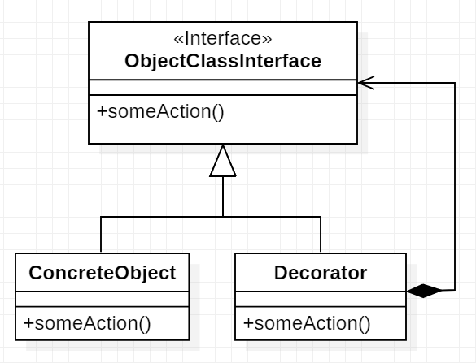

# Decorator
\[GoF\] definition: wrapper to alter behavior of an object
    at runtime without changing its interface
    The wrapped object is not aware of being wrapped

A decorator is used when there are many different behaviors that can
be used together so that the number of subclasses to cover all possible
combinations is exponential.




## Decorator in Python - formal way
Base class
```python
class ObjectClassInterface(object):
    def someAction(self):
        pass
```

Concrete object class
```python
class ConcreteObject(ObjectClassInterface):
    def someAction(self):
        print("something")
```

Decorator class
```python
class Decorator(ObjectClassInterface):
    def __init__(self, obj: ObjectClassInterface):
        self.obj = obj

    def someAction(self):
        self.obj.someAction()
        print("something else")
```

A decorator can wrap another decorator as in this example
```python
if __name__ == "__main__":
    obj = ConcreteObject()
    decorator = Decorator(obj)
    decorator = Decorator(decorator)
    decorator.someAction()

```


## Decorator in Python - Pythonic way
In Python is possible to apply the **monkey pathing**.

From **[Stack Overflow](https://stackoverflow.com/questions/5626193/what-is-monkey-patching)**
Monkey patching is reopening the existing classes or methods in class
at runtime and changing the behavior, which should be used cautiously,
or you should use it only when you really need to.
As Python is a dynamic programming language, Classes are mutable
so you can reopen them and modify or even replace them.

So a Pythonic way to create a decorator is to change the object method
with an extended one at runtime.

```python
class ConcreteObject(object):
    def someAction(self):
        print("something")


def someAction_Decorator(obj):
    # This is important instead of using
    # obj.someAction in the wrapper function
    # for a recursion problem
    func = obj.someAction

    def wrapper(*args, **kwargs):
        func(*args, **kwargs)
        print("something else ")

    # Monkey patching
    obj.someAction = wrapper


if __name__ == "__main__":
    obj = ConcreteObject()
    someAction_Decorator(obj)
    obj.someAction()
```

as variation, to make the decorator a pure function, just the function
to be modified could be passed to the decorator
```python
class ConcreteObject(object):
    def someAction(self):
        print("something")

def someAction_Decorator(func):
    def wrapper(*args, **kwargs):
        func(*args, **kwargs)
        print("something else ")

    return wrapper

if __name__ == "__main__":
    obj = ConcreteObject()
    obj.someAction = someAction_Decorator(obj.someAction)
    obj.someAction()
```

### Python decorators
Python allows you to use decorators in a simpler way with the @ symbol, sometimes called the “pie” syntax.  
In this way is not possible to use a decorator dynamically but can be useful in some context when writing some code.
In the below code, the decorator is used statically in the object code.
```python
class ConcreteObject(object):
    @someAction_Decorator
    def someAction(self):
        print("something")
```

It's possible to use a class version of it, that is a little long than the function one but I think it's cleaner.
This code use the \__call__ magic method: \__call__() method is executed each time you try to call an instance
of the class  

```python
class someAction_ClassDecorator(object):
    def __init__(self, func):
        #  store a reference to the function
        self.func = func

    # this method is called instead of the decorated function.
    def __call__(self, *args, **kwargs):
        self.func(self, *args, **kwargs)
        print("something else")
```
It does essentially the same thing as the wrapper() and the syntax to decorate a method is the same
```python
class ConcreteObject(object):
    @someAction_ClassDecorator
    def someAction(self):
        print("something")
```
